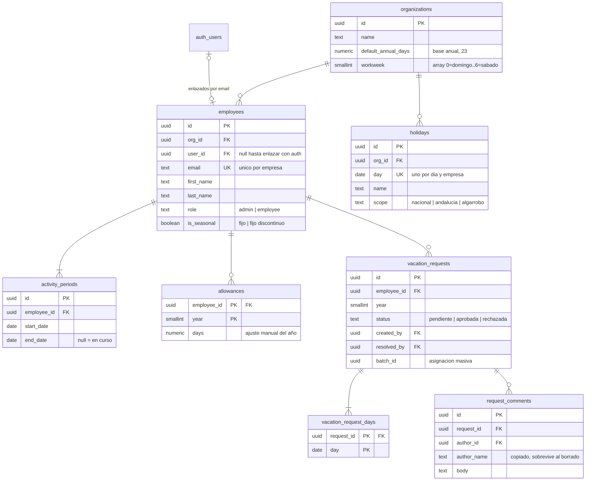

# Supabase: modelo de datos y configuración

Este directorio es **solo el modelo**. La aplicación sigue funcionando contra IndexedDB: conectar el
cliente (`supabase-js`, la pantalla de acceso con email y contraseña y la implementación de
`VacationRepository`) es el paso siguiente.

- **`schema.sql`** — ocho tablas, restricciones, el enlace con Supabase Auth y las políticas RLS. Se
  pega entero en el **SQL Editor** de Supabase. Se puede reejecutar sin que falle, pero no migra: si
  una tabla ya existe, se deja como está.
- **`functions/crear-empleado/`** — Edge Function que da de alta a un empleado (usuario de Auth +
  ficha) desde la propia aplicación, para que el administrador no tenga que entrar en Supabase.

## El modelo



Lo que cuentan las cardinalidades: un empleado tiene **al menos un** periodo de actividad y una
solicitud **al menos un** día, mientras que los comentarios y los ajustes de días pueden no existir.
Y `auth.users ↔ employees` es cero-o-uno por los dos lados: el empleado puede existir antes que su
usuario, que es justo lo que hace posible darlo de alta desde la aplicación y crear el usuario
después.

## Correspondencia con el modelo actual

| Hoy (`src/domain/types.ts`)    | Supabase                                              |
| ------------------------------ | ----------------------------------------------------- |
| `Settings`                     | fila de `organizations` (nombre, base anual, jornada) |
| `Employee`                     | `employees` (+ `user_id` → `auth.users`)              |
| `Employee.pinHash` / `pinSalt` | **desaparecen**: los sustituye la contraseña de Auth  |
| `Employee.activityPeriods[]`   | `activity_periods`                                    |
| `VacationRequest`              | `vacation_requests`                                   |
| `VacationRequest.days[]`       | `vacation_request_days`                               |
| `VacationRequest.comments[]`   | `request_comments`                                    |
| `Holiday`                      | `holidays`                                            |
| `Allowance`                    | `allowances`                                          |
| `newId('emp')` (`emp_a1b2…`)   | `uuid` con `gen_random_uuid()`                        |
| `IsoDate` (`'2026-09-08'`)     | `date`                                                |

Los estados (`role`, `status`, `scope`) van como `text` con un `check`, no como `enum`: cada uno se
usa en una sola columna, y así añadir un valor es cambiar el `check` en vez de un `alter type`. El
cliente los ve como cadenas igual, así que `STATUS_LABEL` y `SCOPE_LABELS` siguen valiendo.

Multiempresa: cada empleado pertenece a una empresa y las políticas aíslan por empresa, así que en
el mismo proyecto pueden convivir varias sin verse entre ellas.

**`vacation_requests` no guarda su propio `org_id`**, a propósito: sería redundante con
`employee_id` (que ya la fija vía `employees`) y, sin una `foreign key` que lo comprobara, nada
impediría que se desincronizaran. Sus políticas usan `employee_in_my_org(employee_id)`, la misma
función que ya usaban `activity_periods` y `allowances` para lo mismo. La columna llegó a existir
en una versión anterior del esquema, y su política de `insert` para el administrador comprobaba
`org_id = current_org_id()` sin comprobar que `employee_id` fuera de su empresa: un admin podía
crear una solicitud a nombre de un empleado de otra empresa con solo poner su propio `org_id`. Sin
la columna, ese hueco no puede existir.

## Por qué RLS es aquí lo único que protege

La aplicación se despliega en **GitHub Pages**, es decir, ficheros estáticos: la `anon key` viaja
dentro del bundle y **es pública**. Cualquiera puede llamar a la API REST de Supabase con ella. Lo
que decide qué puede leer y escribir cada persona son las políticas de `schema.sql`, no el código de
la interfaz: una comprobación que solo esté en React se salta con un `curl`.

Quién puede hacer qué, con sesión iniciada:

| Tabla                   | Lectura                                    | Escritura                                                                                             |
| ----------------------- | ------------------------------------------ | ----------------------------------------------------------------------------------------------------- |
| `organizations`         | la propia                                  | modificar, solo el administrador                                                                      |
| `employees`             | la propia ficha; el admin, toda su empresa | solo el administrador                                                                                 |
| `activity_periods`      | las propias; el admin, todas               | solo el administrador                                                                                 |
| `holidays`              | toda la empresa                            | solo el administrador                                                                                 |
| `allowances`            | los propios; el admin, todos               | solo el administrador                                                                                 |
| `vacation_requests`     | las propias; el admin, todas               | crear: propias y pendientes, o el admin. Resolver: el admin. Borrar: propias y pendientes, o el admin |
| `vacation_request_days` | según su solicitud                         | según su solicitud                                                                                    |
| `request_comments`      | según su solicitud                         | crear firmando como uno mismo, o como cualquiera de su empresa si es admin; no se editan ni se borran |

Esa matriz se aplica en dos capas, y hacen falta las dos: los **permisos de tabla** deciden si el rol
puede tocarla siquiera, y las **políticas RLS** filtran qué filas ve. PostgREST se conecta como
`authenticated` (o como `anon` si no hay sesión), así que sin los `grant` del script la API responde
«permission denied» aunque las políticas sean correctas.

A `anon` no se le concede nada: **sin sesión ni siquiera se llega a evaluar RLS**, la petición se
rechaza antes. Y los verbos que no aparecen arriba tampoco están concedidos, de modo que borrar una
empresa o editar un comentario fallan por permisos, sin depender de que no exista una política.

Que un admin pueda firmar un comentario como otro empleado no es un descuido: separar un día de una
solicitud (`resolveRequestDay()`/`addRequestDayComment()`, en `state/actions.ts`) copia el hilo
entero a la solicitud nueva, y esa copia la ejecuta quien resuelve, no el autor original. Sin este
permiso esa copia fallaría siempre que resolviera alguien distinto de quien escribió el comentario.

Además, dos invariantes del dominio son restricciones declarativas, no código:

| Regla                                     | Dónde                                         |
| ----------------------------------------- | --------------------------------------------- |
| Los periodos de un empleado no se solapan | `exclude … periodos_sin_solape`               |
| Como mucho un periodo abierto             | índice parcial `activity_periods_uno_abierto` |

El resto de reglas de negocio (no comprometer el mismo día dos veces, no borrar al único
administrador, no borrar a quien no está de baja) se quedan en `src/state/actions.ts`, que es donde
ya estaban.

**Toda llamada a `is_admin()`, `current_org_id()` o `current_employee_id()` dentro de una política
va envuelta en `(select ...)`.** Sin el `select`, Postgres no puede tratarla como constante para
toda la consulta y la reejecuta —con su propia subconsulta a `employees`— fila a fila; con él, la
calcula una sola vez por consulta (es la optimización que recomienda la propia documentación de
Supabase para RLS). No aplica a `employee_in_my_org()`, `can_read_request()` ni
`can_write_request()`, que reciben una columna de la fila como argumento: al depender de la fila,
no se pueden precalcular una sola vez para toda la consulta. Cualquier política nueva que añada una
de las tres primeras funciones debe seguir el mismo patrón.

## Altas y acceso: el administrador lo hace todo

Nadie se registra por su cuenta y **el administrador nunca entra en Supabase**. Da de alta desde la
propia aplicación, incluida la contraseña:

```
Admin en la app: «Nuevo empleado» → nombre, rol, tipo de contrato y contraseña
        │  (llamada con el JWT del admin)
        ▼
Edge Function `crear-empleado`     ← aquí vive la service_role key, nunca en el navegador
        │  1. comprueba en la base de datos que quien llama es admin
        │  2. crea el usuario en auth.users con esa contraseña, ya confirmado
        │  3. inserta la ficha en employees y su primer periodo de actividad
        ▼
El empleado ya puede entrar con su contraseña
```

Si algo falla a mitad, la función deshace lo anterior: un usuario de auth huérfano bloquearía ese
email para siempre.

**Es una contraseña de 8 caracteres o más, no un PIN numérico**, y este es el motivo: el PIN de la
aplicación antigua no protegía nada —los datos estaban en el IndexedDB del dispositivo y se leían
igual—, así que daba lo mismo que fuera adivinable. Con Supabase pasa a ser lo único que separa a un
desconocido de los datos de la empresa, y un PIN de 6 dígitos son 10⁶ combinaciones contra un
endpoint público: el límite de Supabase Auth al `grant_type=password` es
`GOTRUE_RATE_LIMIT_TOKEN_REFRESH`, 150 intentos por cada 5 minutos, con lo que recorrer ese espacio
entero desde una sola IP son unas tres semanas. Con caracteres libres no hay tal cuenta que hacer.

El mínimo de Supabase son 6 caracteres (`defaultMinPasswordLength` en su código, sube en silencio
cualquier valor menor que configures); aquí se piden 8, y el tope de 72 lo pone bcrypt, que ignora
lo que pase de ahí. Tampoco puede quedarse en blanco, como sí permitía la aplicación antigua.

La aplicación todavía pide un PIN, y se queda así hasta que se conecte el cliente: cambiarlo antes
solo endurecería el acceso a unos datos que siguen estando en el IndexedDB del dispositivo, sin
ganar nada. Con el cliente se van `hashPin()`/`verifyPin()` enteras —de eso se encarga Auth— y
`isValidPin()` pasa a ser una comprobación de longitud sobre una contraseña.

**La pantalla de acceso sigue siendo elegir perfil y teclear la contraseña.** Esa lista se pide sin
sesión, así que ninguna política puede servirla: la sirve `perfiles_para_acceso(slug)`, una función
`security definer` que es la única rendija abierta a `anon`. Devuelve nombre y email interno de los
empleados de una empresa, y solo de los que ya tienen usuario.

Asúmelo como público: **quien tenga la URL puede leer la plantilla de la empresa** (nombres, no
datos). Lo que protege la información es la contraseña. Si eso no te vale, la alternativa es pedir el
email en vez de listar perfiles, y entonces sin sesión no se puede leer nada en absoluto.

**Que el administrador reparta la contraseña inicial no quita que se pueda cambiar después.**
Cambiarla es `supabase.auth.updateUser({ password })` con la sesión ya iniciada: no es registrarse,
no pasa por el correo y no obliga al administrador a intervenir. Merece la pena, porque una
contraseña dictada por WhatsApp y jamás rotada acaba siendo peor que un PIN.

El `slug` de la empresa (`organizations.slug`, p. ej. `agrorifer`) es lo que le dice a esa función de
qué empresa listar, ya que sin sesión no hay forma de saberlo. **Va en la URL, no en una variable de
entorno**: `/agrorifer` es la puerta de esa empresa, y un mismo despliegue de la aplicación sirve a
todas las que compartan proyecto de Supabase — `App.tsx` decide por el primer tramo de la URL si es
modo local o el de una empresa, con `isCompanySlug()` (`src/domain/orgSlug.ts`), que prohíbe como
nombre de empresa las mismas palabras que ya son rutas locales (`empleados`, `ajustes`…). El mismo
`check` vive en `organizations.slug` para que no se pueda crear una empresa inalcanzable por error.

## Configuración en el panel de Supabase

1. **Crear el proyecto** (región de la UE). En el apartado **Security** de la creación:

   | Opción                              | Cómo                                                                                                                                              |
   | ----------------------------------- | ------------------------------------------------------------------------------------------------------------------------------------------------- |
   | **Enable Data API**                 | **Activada.** Es la API REST contra la que habla `supabase-js`; sin ella la aplicación no tiene por dónde entrar                                  |
   | **Automatically expose new tables** | **Desactivada.** `schema.sql` concede los permisos tabla por tabla, así que lo que se expone es exactamente eso y no lo que aparezca en el futuro |
   | **Enable automatic RLS**            | Opcional. El script ya activa RLS en las ocho tablas; esto solo añade una red por si algún día alguien crea una tabla a mano y se olvida          |

   Después, ejecutar `schema.sql` en el **SQL Editor**.

2. **Authentication → Sign In / Providers → Email**: dejar el proveedor activo, pero
   - **desactivar «Allow new users to sign up»** — nadie se registra solo; las altas las hace el
     administrador;
   - **desactivar «Confirm email»** — los usuarios que crea el administrador llevan una contraseña
     entregada en mano y deben poder entrar sin pasar por el correo (los emails son internos, del
     tipo `luis@agrorifer.local`, y no reciben nada);
   - **subir «Minimum password length» a 8**, a juego con lo que exige la Edge Function. Aquí está
     también **«Prevent use of leaked passwords»** (contrasta contra Have I Been Pwned), que no
     cuesta nada activar. «Password Requirements» (obligar a mayúsculas, dígitos o símbolos) es
     opcional: con 8 caracteres libres la longitud ya hace el trabajo, y forzar composición suele
     acabar en la contraseña apuntada en un papel.

3. **Arranque**: en el SQL Editor, descomentar el bloque del final de `schema.sql`, rellenar el email
   y ejecutarlo. Crea la empresa, la ficha del primer administrador (sin `user_id` todavía) y su
   periodo de actividad. Hace falta hacerlo desde ahí porque el SQL Editor ejecuta como `postgres` y
   no pasa por RLS: RLS necesita una fila en `employees` para saber a qué empresa perteneces, y el
   primer administrador todavía no la tiene.

4. **Authentication → Users → Add user**: crear el usuario con el **mismo email** que acabas de poner
   en el SQL Editor y una contraseña, marcando **«Auto Confirm User»**. No hace falta copiar ningún
   UUID ni volver al SQL Editor: el trigger `link_employee_to_auth_user()` empareja la ficha con este
   usuario en cuanto se crea, por email — es el mismo trigger que enlaza a cualquier empleado
   posterior si alguna vez creas su usuario a mano en el panel en vez de por la aplicación.

5. **Los festivos** se añaden desde Ajustes. No van en el script a propósito: la lista ya vive en
   `src/domain/holidays.es.ts` y `CLAUDE.md` obliga a contrastarla con el BOE y el BOJA, así que
   tenerla en dos sitios sería una trampa. Cuando se conecte el cliente los sembrará
   `seedHolidays()`, que ya existe.

6. **Desplegar las dos Edge Functions**, con el [CLI de Supabase](https://supabase.com/docs/guides/cli):

   ```bash
   supabase functions deploy crear-empleado
   supabase functions deploy cambiar-password
   ```

   No hace falta configurarles nada: `SUPABASE_URL` y `SUPABASE_SERVICE_ROLE_KEY` ya están en el
   entorno de toda Edge Function. A partir de aquí, las altas y los cambios de contraseña se hacen
   desde la aplicación.

   El trigger `link_employee_to_auth_user()` se queda como red de seguridad, por si alguna vez creas
   un usuario a mano en el panel: empareja por email la ficha que estuviera esperando.

7. **Database → Replication**: añadir las ocho tablas a la publicación `supabase_realtime` si
   quieres que un cambio hecho en un dispositivo aparezca en el otro **sin recargar**. Sin este
   paso los datos siguen compartidos entre dispositivos —`supabaseRepository.load()` los trae
   todos en cada arranque y `save()` los escribe de verdad—, solo que un cambio ajeno no aparece
   hasta la siguiente carga de la pantalla.

8. **Settings → API**: copiar el _Project ID_ (el subdominio de `<ref>.supabase.co`, no la URL
   completa) y la _anon public key_. Van al repositorio como `VITE_SUPABASE_PROJECT_REF` (variable:
   no es secreto, ya viaja embebido en el bundle público) y `VITE_SUPABASE_ANON_KEY` (secreto), y se
   pasan al paso `npm run build` del workflow de Pages. Hacen falta en el paso siguiente, no todavía.

No hay que tocar CORS (la API REST de Supabase acepta cualquier origen) ni las _Redirect URLs_ (solo
importan con enlaces mágicos u OAuth, y aquí es email + contraseña).

**La `service_role key` no se usa en ningún sitio del cliente**: se salta RLS entera. Solo vale para
scripts que ejecutes tú o para una Edge Function.

## Qué hay ya, y qué queda

Ya está todo el modo empresa funcionando de punta a punta: entrar en `/<slug>`
(`src/pages/CompanyGate.tsx`) lista los perfiles vía `perfiles_para_acceso()`, entra con
`signInWithPassword()` y, en cuanto hay sesión, monta la aplicación completa —las ocho pantallas,
igual que en modo local— contra `supabaseRepository.ts`. La sesión sobrevive a un recargo de
página (`getSession()`) y a un cierre desde otra pestaña (`onAuthStateChange()`). Altas y cambios
de contraseña pasan por las Edge Functions `crear-empleado`/`cambiar-password`, nunca por una
escritura directa a `employees`. `CLAUDE.md`, sección «El modo empresa», documenta cómo encaja
esto con `state/actions.ts` y el resto de la aplicación —la arquitectura de instantánea + diff, el
motor de diff, la cola de escrituras— con más detalle del que tiene sentido repetir aquí.

Lo que queda:

- **Tiempo real.** Hoy un cambio hecho en un dispositivo no aparece en otro hasta la siguiente
  carga de la pantalla — ver el paso 7 de arriba (`Database → Replication`) para lo que falta en
  el panel; en el cliente haría falta suscribirse a los cambios de cada tabla y fusionarlos con el
  `Database` en memoria, no solo recargar.
- **Que el propio empleado cambie su contraseña.** Hoy solo puede hacerlo un administrador, vía
  `cambiar-password`. El camino de autoservicio (`supabase.auth.updateUser({ password })`, que no
  necesita Edge Function porque cada uno puede cambiar la suya) no está construido.
- **Subir lo que ya haya en IndexedDB.** Migrar de modo local a modo empresa es manual hoy: no hay
  ningún camino para volcar los datos de un navegador en un proyecto de Supabase.
