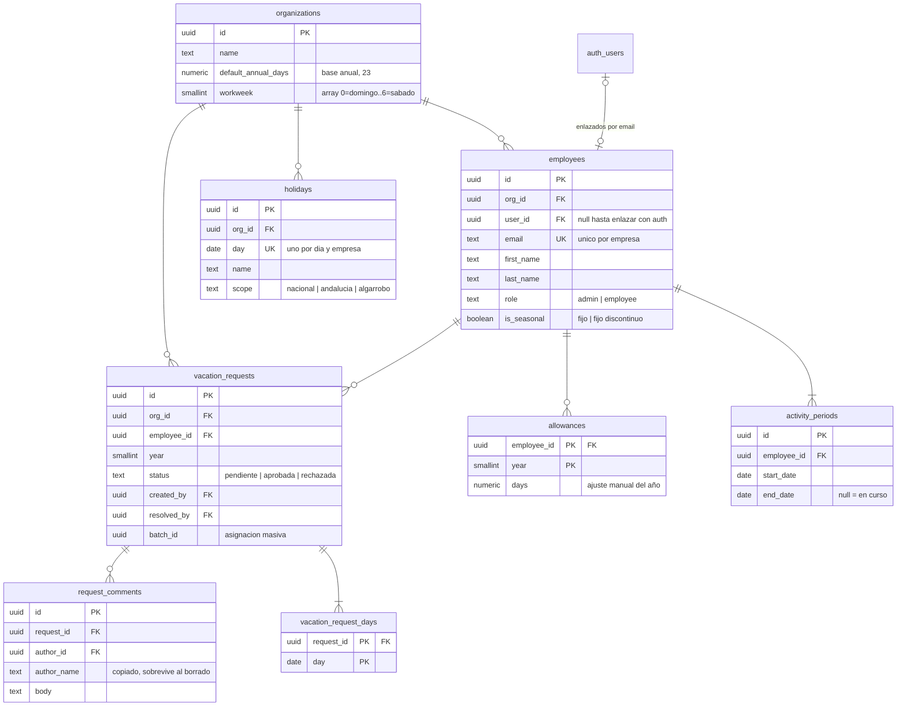

# Supabase: modelo de datos y configuración

Este directorio es **solo el modelo**. La aplicación sigue funcionando contra IndexedDB: conectar el
cliente (`supabase-js`, la pantalla de acceso con email y contraseña y la implementación de
`VacationRepository`) es el paso siguiente.

- **`schema.sql`** — ocho tablas, restricciones, el enlace con Supabase Auth y las políticas RLS. Se
  pega entero en el **SQL Editor** de Supabase. Se puede reejecutar sin que falle, pero no migra: si
  una tabla ya existe, se deja como está.

## El modelo

Lo que cuentan las cardinalidades: un empleado tiene **al menos un** periodo de actividad y una
solicitud **al menos un** día, mientras que los comentarios y los ajustes de días pueden no existir.
Y `auth.users ↔ employees` es cero-o-uno por los dos lados: el empleado puede existir antes que su
usuario, que es justo lo que hace posible darlo de alta desde la aplicación y crear el usuario
después.

## Correspondencia con el modelo actual

| Hoy (`src/domain/types.ts`)    | Supabase                                              |
| ------------------------------ | ----------------------------------------------------- |
| `Settings`                     | fila de `organizations` (nombre, base anual, jornada) |
| `Employee`                     | `employees` (+ `user_id` → `auth.users`)              |
| `Employee.pinHash` / `pinSalt` | **desaparecen**: los sustituye Supabase Auth          |
| `Employee.activityPeriods[]`   | `activity_periods`                                    |
| `VacationRequest`              | `vacation_requests`                                   |
| `VacationRequest.days[]`       | `vacation_request_days`                               |
| `VacationRequest.comments[]`   | `request_comments`                                    |
| `Holiday`                      | `holidays`                                            |
| `Allowance`                    | `allowances`                                          |
| `newId('emp')` (`emp_a1b2…`)   | `uuid` con `gen_random_uuid()`                        |
| `IsoDate` (`'2026-09-08'`)     | `date`                                                |

Los estados (`role`, `status`, `scope`) van como `text` con un `check`, no como `enum`: cada uno se
usa en una sola columna, y así añadir un valor es cambiar el `check` en vez de un `alter type`. El
cliente los ve como cadenas igual, así que `STATUS_LABEL` y `SCOPE_LABELS` siguen valiendo.

Multiempresa: cada empleado pertenece a una empresa y las políticas aíslan por empresa, así que en
el mismo proyecto pueden convivir varias sin verse entre ellas.

## Por qué RLS es aquí lo único que protege

La aplicación se despliega en **GitHub Pages**, es decir, ficheros estáticos: la `anon key` viaja
dentro del bundle y **es pública**. Cualquiera puede llamar a la API REST de Supabase con ella. Lo
que decide qué puede leer y escribir cada persona son las políticas de `schema.sql`, no el código de
la interfaz: una comprobación que solo esté en React se salta con un `curl`.

Quién puede hacer qué, con sesión iniciada:

| Tabla                   | Lectura                                    | Escritura                                                                                             |
| ----------------------- | ------------------------------------------ | ----------------------------------------------------------------------------------------------------- |
| `organizations`         | la propia                                  | modificar, solo el administrador                                                                      |
| `employees`             | la propia ficha; el admin, toda su empresa | solo el administrador                                                                                 |
| `activity_periods`      | las propias; el admin, todas               | solo el administrador                                                                                 |
| `holidays`              | toda la empresa                            | solo el administrador                                                                                 |
| `allowances`            | los propios; el admin, todos               | solo el administrador                                                                                 |
| `vacation_requests`     | las propias; el admin, todas               | crear: propias y pendientes, o el admin. Resolver: el admin. Borrar: propias y pendientes, o el admin |
| `vacation_request_days` | según su solicitud                         | según su solicitud                                                                                    |
| `request_comments`      | según su solicitud                         | crear firmando como uno mismo; no se editan ni se borran                                              |

Sin sesión (`anon`) no hay ninguna política: no se ve absolutamente nada.

Además, dos invariantes del dominio son restricciones declarativas, no código:

| Regla                                     | Dónde                                         |
| ----------------------------------------- | --------------------------------------------- |
| Los periodos de un empleado no se solapan | `exclude … periodos_sin_solape`               |
| Como mucho un periodo abierto             | índice parcial `activity_periods_uno_abierto` |

El resto de reglas de negocio (no comprometer el mismo día dos veces, no borrar al único
administrador, no borrar a quien no está de baja) se quedan en `src/state/actions.ts`, que es donde
ya estaban.

## Configuración en el panel de Supabase

1. **Crear el proyecto** (región de la UE) y ejecutar `schema.sql` en el **SQL Editor**.

2. **Authentication → Sign In / Providers → Email**: dejar el proveedor activo, pero
   - **desactivar «Allow new users to sign up»** — nadie se registra solo; las altas las hace el
     administrador;
   - **desactivar «Confirm email»** — los usuarios que crea el administrador llevan una contraseña
     entregada en mano y deben poder entrar sin pasar por el correo (los emails son internos, del
     tipo `luis@agrorifer.local`, y no reciben nada).

3. **Authentication → Users → Add user**: crear el primer usuario con su email y contraseña,
   marcando **«Auto Confirm User»**. Copiar su UUID.

4. **Arranque**: en el SQL Editor, descomentar el bloque del final de `schema.sql`, pegar ese UUID y
   ejecutarlo. Crea la empresa, su primer administrador y su periodo de actividad. Hace falta
   hacerlo desde ahí porque el SQL Editor ejecuta como `postgres` y no pasa por RLS: RLS necesita una
   fila en `employees` para saber a qué empresa perteneces, y el primer administrador todavía no la
   tiene.

5. **Los festivos** se añaden desde Ajustes. No van en el script a propósito: la lista ya vive en
   `src/domain/holidays.es.ts` y `CLAUDE.md` obliga a contrastarla con el BOE y el BOJA, así que
   tenerla en dos sitios sería una trampa. Cuando se conecte el cliente los sembrará
   `seedHolidays()`, que ya existe.

6. **Dar de alta a alguien nuevo** (mientras no exista la Edge Function del paso siguiente):
   1. crear el empleado desde la aplicación, con su email;
   2. crear el usuario en **Authentication → Users** con **ese mismo email**.

   El trigger `link_employee_to_auth_user()` los empareja solo en cuanto se crea el usuario.

7. **Database → Replication**: añadir las ocho tablas a la publicación `supabase_realtime` si quieres
   que un cambio hecho en un dispositivo aparezca en el otro sin recargar. Es justo lo que hoy no se
   puede hacer («Los datos no se sincronizan» en `CLAUDE.md`).

8. **Settings → API**: copiar _Project URL_ y _anon public key_. Van como secretos del repositorio
   (`VITE_SUPABASE_URL`, `VITE_SUPABASE_ANON_KEY`) y se pasan al paso `npm run build` del workflow de
   Pages. Hacen falta en el paso siguiente, no todavía.

No hay que tocar CORS (la API REST de Supabase acepta cualquier origen) ni las _Redirect URLs_ (solo
importan con enlaces mágicos u OAuth, y aquí es email + contraseña).

**La `service_role key` no se usa en ningún sitio del cliente**: se salta RLS entera. Solo vale para
scripts que ejecutes tú o para una Edge Function.

## Qué queda para el paso siguiente

- Cliente `supabase-js`, acceso con email y contraseña e implementación de `VacationRepository`
  contra Supabase.
- Edge Function para que el administrador cree usuarios desde la propia aplicación (la Admin API
  necesita la `service_role key`, que nunca puede ir en el navegador). Mientras tanto, el paso 6.
- Subir lo que ya tengas en IndexedDB: exportar el JSON desde Ajustes y volcarlo con un script.
